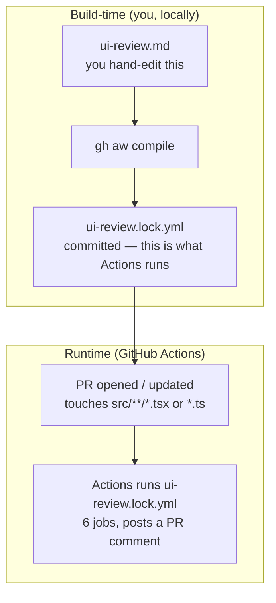
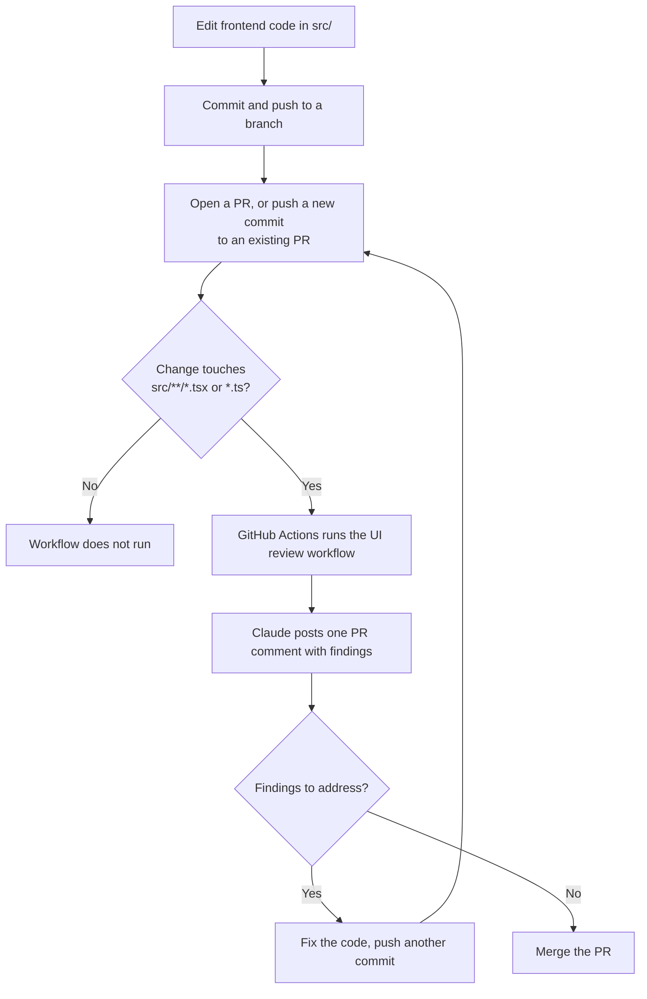

# DocConnect Agent Demo

A small React app used to demo [GitHub Agentic Workflows](https://github.github.com/gh-aw/).
Open a pull request, an AI agent reviews it against the team's front-end
standards and posts a comment. Read-only token, no secrets in the agent, and a
comment is the only thing it is permitted to write.

## Setup (once, before the demo)

```bash
npm install
npm run dev            # optional — confirms the app runs

gh repo create docconnect-agent-demo --private --source=. --push

gh extension install github/gh-aw
gh aw compile
git add .github/workflows/ui-review.lock.yml
git commit -m "Compile UI review workflow"
git push
```

Pick an engine when prompted. Copilot uses your existing subscription with no
extra secret. For Claude, set the key yourself:

```bash
gh secret set ANTHROPIC_API_KEY
```

**Rehearse once.** Run `./demo/open-bad-pr.sh`, confirm the comment lands, then
`./demo/reset.sh`. A run takes two to three minutes.

## Running the demo

```bash
./demo/open-bad-pr.sh
```

That branches, drops `demo/DocumentPanel.tsx` into `src/components/`, pushes,
and opens the PR. The workflow fires on the path filter. Talk through the job
graph in the Actions tab while it works — the six boxes are the security story:

| Job | What it does |
| --- | --- |
| `pre_activation` | Decides whether this should run at all |
| `activation` | Builds the prompt from repo and PR context |
| `agent` | The sandboxed run — read-only token, network firewall, no secrets |
| `detection` | Scans what the agent proposed for anything suspicious |
| `safe_outputs` | Applies only the writes declared in the frontmatter |
| `conclusion` | Reports the run |

Afterwards: `./demo/reset.sh`, and close the PR.

## How it works

GitHub Actions only ever runs `.yml` files, never `.md`. `gh aw compile` reads
`ui-review.md` and generates `ui-review.lock.yml` — that generated file is what
Actions actually executes. Editing the `.md` without recompiling changes
nothing.



### Day-to-day developer flow



## What the agent should find

`demo/DocumentPanel.tsx` breaks six rules on purpose:

1. `fetch` called inside the component instead of a hook
2. Hardcoded API URL, bypassing `src/api/client.ts`
3. `any` on props, state, and callback parameters
4. No loading, error, or empty state
5. A clickable `div` instead of a button — unreachable by keyboard
6. Inline styles where `src/index.css` already has tokens

The clean equivalent is `src/components/DocumentList.tsx` and
`src/components/DocumentRow.tsx` with `src/hooks/useDocuments.ts`. Good contrast
to put side by side on screen.

It is a model, not a linter, so it may raise something you did not plant. Don't
script your narration to an exact finding.

## Structure

```
src/api/client.ts        The only module that touches the network
src/hooks/useDocuments.ts  Owns loading, error, and empty state
src/components/          Presentational only
.github/workflows/ui-review.md    The agentic workflow (source)
demo/                    The bad file and the demo scripts
```

## Changing the review rules

Edit the markdown body of `.github/workflows/ui-review.md`, then:

```bash
gh aw compile
```

Commit both the `.md` and the generated `.lock.yml` — the lock file is what
Actions actually runs.

## Where this goes next

### Built here

| Workflow | Trigger | Allowed to write |
| --- | --- | --- |
| UI review | PR opened or updated, touching `src/**/*.tsx` or `*.ts` | One PR comment |

### Candidates

**CI failure triage.** Triggers on a failed build. Reads the failing job's
logs and the PR diff, and posts a comment saying whether this looks like a
code problem or an infrastructure flake — a bad test assertion versus a
runner timeout. Worth doing because "is this my fault" is the first question
anyone asks when a build goes red, and it currently costs a human a few
minutes of log-reading to answer. The honest trade-off: logs are long and
noisy, and a confident "just a flake, retry" on an actual regression is worse
than no comment at all.

**Docs drift.** Triggers on push to main. Reads the architecture reference
doc alongside the code paths it describes, and opens a PR updating the
sections that no longer match. Worth doing because architecture docs go
stale the moment code changes without the doc changing alongside it, and
nobody remembers to update prose in the same commit as the diff it
describes. The honest trade-off: it demos badly — whether it picked the
right section and wrote something true only shows up over weeks of drift,
not in a five-minute run.

**Cross-repo contract drift.** Triggers on a schedule, since no single push
event covers two repos. Reads the API's schema in one repo and the BFF or
front-end types meant to mirror it in another, and opens an issue when they
diverge. Worth doing because a backend contract change with no matching
client-type update is exactly the kind of thing that surfaces as a runtime
bug days later instead of a review comment now. The honest trade-off: the
cross-repo checkout and auth plumbing is the real work here, not the prompt —
budget for that, not for agent tuning.

**Dependency and CVE digest.** Triggers weekly. Reads the dependency
manifest and current advisories for what's installed, and opens one issue
summarising what needs attention now versus what can wait. Worth doing
because it turns a scattering of automated alerts into a single prioritised
read. The honest trade-off: it is boring by design — there is nothing to
show on screen except an issue with a sensible list in it, which is exactly
what makes it easy to skip building.

**Release notes.** Triggers on a version tag. Reads the PRs merged since the
last tag, and drafts release notes as a PR or draft release. Worth doing
because nobody enjoys writing release notes by hand and most of the raw
material already exists in PR titles and descriptions. The honest
trade-off: it reads great in a demo, but the output is only as good as the
PR descriptions feeding it — vague PR titles in, generic notes out.

**Onboarding Q&A.** Triggers when a new joiner opens an issue asking a
question about the codebase. Reads the relevant files to answer it, and
posts a comment with the answer and file references. Worth doing because it
shortens the loop of asking in chat and waiting for whoever knows that part
of the code. The honest trade-off: it's reliable for "where does X live"
questions and risky for nuanced ones — a wrong, confident answer to an
architectural question is worse than a shrug.

Before adding more of these: every trigger is an agent run, and every agent
run costs tokens and time, so schedule and volume matter as much as the
idea. A workflow that opens a PR can itself trigger other `on: pull_request`
workflows — including this one — so chain them deliberately or you get
review workflows reviewing each other's output. And the thing that actually
keeps any of this safe is not the prompt. It's the `safe-outputs` allowlist
and the permissions block, the same as the UI review workflow above — assume
the agent will eventually try something outside the brief, and let the
allowlist be what stops it.
